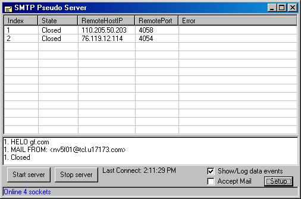

## cSocket2 IPv6

### Description

Description: CSocket2 is a Winsock Control substitute. It behaves very much like the Microsoft Winsock Control. The Winsock Control is not the easiest thing in the world to work with, but it is a lot easier than working directly with the Winsock API. Unfortunately, the Winsock Control does not support IPv6, and it doesn’t look like it ever will. Microsoft seems to have abandoned it in favor of managed code in .NET.

So what are the alternatives for VB programmers who do not want to get involved with C++ orC#. "Csocket" by Oleg Gdalevich is a drop-in replacement for the Winsock Control. It was further enhanced by Emiliano Scavuzzo with his "CsocketMaster" class. There are a number of advantages with using a Class Module instead of a Control, not the least of which is that it can be modified to suit special needs. These 2 authors took a different approach, but both use "callbacks". VB6 does not do threading very well, so callbacks are the only real way of communicating with the Windows messaging system. The use of callbacks instead of threads is sometimes referred to as Non-Blocking calls versus Blocking calls.

If only a few sockets are required, we would recommend using the cSocket2 class and module directly. One such program demonstrating this is the included "Chat" program. If however, you need multiple sockets for a server type application, then a socket array is the only viable choice. The included SMTP Pseudo Server application demonstrates this approach using the cSocket.ocx ActiveX Control.
 
### More Info
 

             |
---                |---
**Submitted On**   |2012-01-12 17:39:08
**By**             |[J\.A\. Coutts](https://github.com/Planet-Source-Code/PSCIndex/blob/master/ByAuthor/j-a-coutts.md)
**Level**          |Advanced
**User Rating**    |5.0 (10 globes from 2 users)
**Compatibility**  |VB 6\.0
**Category**       |[Complete Applications](https://github.com/Planet-Source-Code/PSCIndex/blob/master/ByCategory/complete-applications__1-27.md)
**World**          |[Visual Basic](https://github.com/Planet-Source-Code/PSCIndex/blob/master/ByWorld/visual-basic.md)
**Archive File**   |[cSocket2\_I2218081132012\.zip](https://github.com/Planet-Source-Code/j-a-coutts-csocket2-ipv6__1-74240/archive/master.zip)

